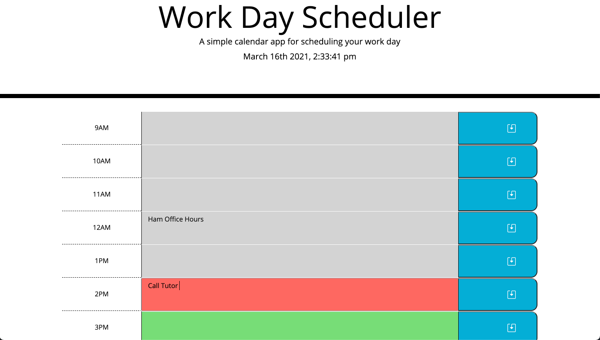

# Challenge 5: Third-Party APIs Challenge: Work Day Scheduler

## Work Day PLanner 
-------------------------------------------------
As a busy employee and student. 
I want to be able to organize my meetings, assignments and tasks for the day in a daily planner.
So that I can manage my time effectively and find a good work-life balance.
-------------------------------------------------
-------------------------------------------------

## Features
With this daily planner you are able to:
Create a schedule to keep track of your daily tasks within work-day hours.
* When you open the planner:
    - You are presented with the current date and time at the top of the page.
    - You are presented with time blocks with standard business hours.
* When you view the time blocks:
    - You are presented with color-coded block that indicate whether a time block is in the past, present, or future of the current time.
* When you click the time block:
    - You are able to add/edit the time blocks text to enter an event.
    - There is a button presented to the right of you to save the task.
    - Tasks entered are saved to locak storage
* When you refresh the page: 
    - The saved tasks persist.

------------------------------------------------

------------------------------------------------
------------------------------------------------
Website URL:
https://balloonicorn92.github.io/super-disco/
